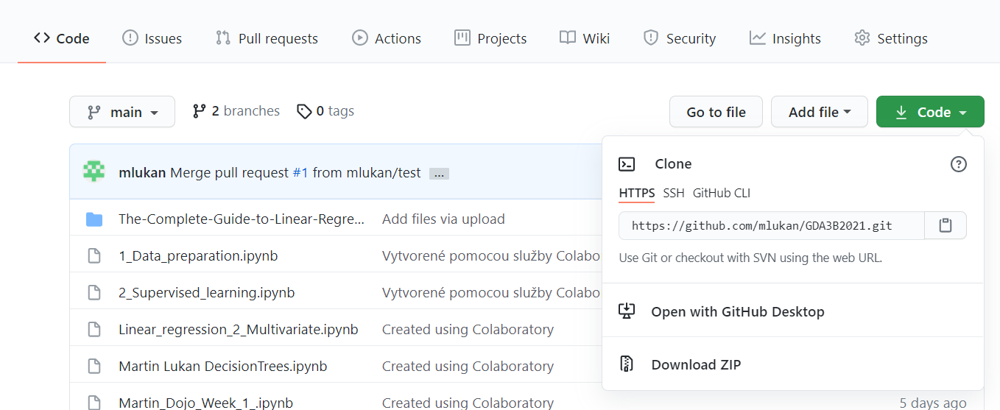
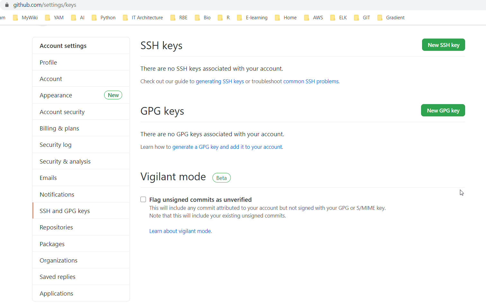
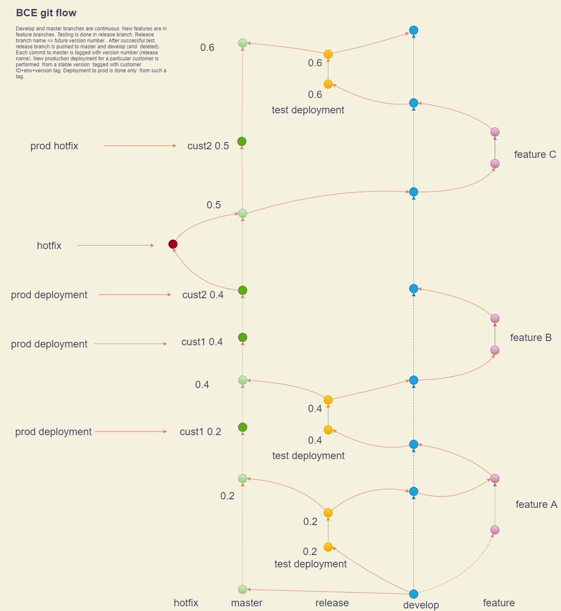

# Git - a distributed version control system
[Git web page](https://git-scm.com/) 
### Watch this youtube videos for more info on:
Github  
[https://www.youtube.com/watch?v=w3jLJU7DT5E](https://www.youtube.com/watch?v=w3jLJU7DT5E)  
Git and github use  
[https://www.youtube.com/watch?v=SWYqp7iY_Tc](https://www.youtube.com/watch?v=SWYqp7iY_Tc)

## Install git

### **Fedora-like**
`sudo dnf install git-all` 

### **Debian-based**
`sudo apt install git-all` 
### **Windows**
[https://git-scm.com/download/win](https://git-scm.com/download/win) 

# Set up a github account
[Github](https://github.com/) 

# Download a github repository:

### From the command line
1. Navigate to the directory where you want to download the project
2. `git clone <repo download link>`
3. Navigate to the new project directory
4. Check files, check `git status`

> There are multiple access options. If the registry is private, you might have to ask the owner to \
  give you SSH access, in which case he'll have to register your SSH key here:

# Useful git commands
`git status` 
Check the status of your git filesystem .
Returns status of all modifications (modified files, untracked files, unmerged commits etc) on your local copy. **It does not return the status of the remote (origin)!**  

`git pull`  
Downloads the current status of the remote repository. 
**It is always a good idea to make a pull before starting to make any changes  

`git add <file name>`  
Add modified/untracked file to the commit stage

`git add -A`  
Add all modified and untracked files to the commit stage  

`git rm --cache <file>`  
Remove modified file from the commit stage (does not delete the file, just does not include the modified version in the commit) 

`git commit -m "<Commit message here>"`  
Commit your modified files (after `git add`). Creates a snapshot (file version) in your local copy of the repository.Commit message will be the commit description. 

`git push`  
Pushes your local commit to the remote repository

# Merge/pull requests
**TBD**
# Gitflow
Git workflow is designed  to enforce  clean repository structure and seamless CI/CD. 
[https://www.atlassian.com/git/tutorials/comparing-workflows/gitflow-workflow](https://www.atlassian.com/git/tutorials/comparing-workflows/gitflow-workflow) 

Provides additional commands that support easy maintenance of workflows as the one depicted [here](files/BCE-gitflow.io): 
 

## Installation
[https://github.com/nvie/gitflow/wiki/Installation](https://github.com/nvie/gitflow/wiki/Installation)

# Telekom devops gitlab
Official DT gitlab instance. Everyone with EMEA1,EMEA2 or ZAM account can register.  
[https://gitlab.devops.telekom.de/](https://gitlab.devops.telekom.de/)  
1. Approved by DT for internal projects
2. Provides CI/CD integration
3. 2-factor authentication using OTP authenticator
4. Command line access allowed using https with access token

### Here you can create your access token in gitlab:
User > Preferences > Access tokens  
